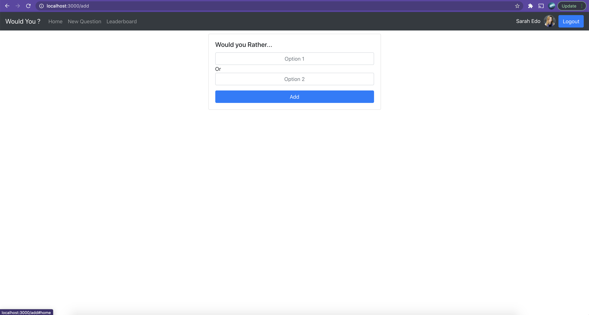

# Udacity React App 02
# Introduction
This is a “Would You Rather?” game. A user is asked a question in the form: “Would you rather [option A] or [option B] ?”. And there is a poll  which indicates the votes for ther user.

# Installation

* `npm install`
* `npm start` or `sudo npm start`
* On browser `localhost:3000`

## Demo
​	You can view published demo on `https://mustafah.surge.sh/`

# Screenshots

## Login Page

## Home Page

## Leaderboard Page

## Create Question Page

